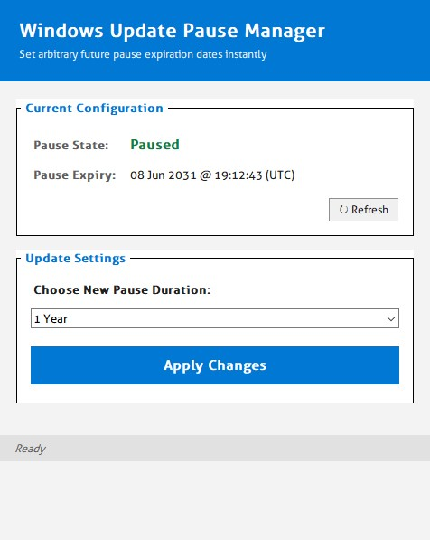

<div align="center">

```
██╗    ██╗██╗   ██╗██████╗ ███╗   ███╗
██║    ██║██║   ██║██╔══██╗████╗ ████║
██║ █╗ ██║██║   ██║██████╔╝██╔████╔██║
██║███╗██║██║   ██║██╔═══╝ ██║╚██╔╝██║
╚███╔███╔╝╚██████╔╝██║     ██║ ╚═╝ ██║
 ╚══╝╚══╝  ╚═════╝ ╚═╝     ╚═╝     ╚═╝
```

**Windows Update Pause Manager**

*Freeze Windows Updates. Any date. One click. Zero bloat.*

[](https://github.com)
[](https://github.com)
[](LICENSE)
[](https://github.com)
[](https://github.com)

---



---

</div>

## ⚡ What It Does

Set your updates to pause until **2029**, **2035**, or any date you choose — then walk away. No background services. No tray icon. No bloat. One click and it's done.

---

## 🔬 How It Works

Deep registry forensics revealed something Windows doesn't advertise:

```
HKLM\SOFTWARE\Microsoft\WindowsUpdate\UX\Settings
          │
          ├─► PauseUpdatesExpiryTime          ◄── Set to any future date
          ├─► PauseFeatureUpdatesEndTime      ◄── Survives every reboot ✅
          ├─► PauseQualityUpdatesEndTime      ◄── UI syncs automatically ✅
          └─► PauseFeatureUpdatesStartTime    ◄── Clean restore anytime ✅
```

> **The Discovery:** Windows Update's UI reads directly from these keys and accepts arbitrary future dates without resetting them on boot. Set `2029-06-16T07:56:22Z` — Windows shows *"paused until 2029"* — permanently, until **you** say otherwise.

---

## ✨ Features

| | Feature | Detail |
|---|---|---|
| 🛡️ | **Auto UAC Elevation** | Detects admin rights, prompts if needed |
| 📦 | **Backup Before Every Change** | JSON snapshot: `wua_pause_backup_YYYYMMDD_HHMMSS.json` |
| ⚡ | **7 Pause Presets** | 7 Days · 30 Days · 90 Days · 1 Year · 3 Years · 5 Years |
| 📅 | **Custom Date Input** | Set any precise target date |
| 🧼 | **One-Click Restore** | Resume Updates clears all keys cleanly |
| 🚫 | **Zero Overhead** | 0% CPU when closed. No services. No tray. |

---

## 🚀 Quick Start

```bash
# 1. Download from Releases
pause_manager.exe

# 2. Double-click → Accept UAC prompt

# 3. Pick a preset or enter a custom date

# 4. Click Apply ✅
```

> Done. Updates are frozen until your chosen date, reboot-proof.

---

## 🔒 Backup Format

Every change writes a timestamped backup to your working directory:

```json
{
  "PauseUpdatesExpiryTime":         { "value": "2029-01-01T00:00:00Z", "type": 1 },
  "PauseFeatureUpdatesStartTime":   { "value": "2026-06-09T07:56:22Z", "type": 1 },
  "PauseFeatureUpdatesEndTime":     { "value": "2029-01-01T00:00:00Z", "type": 1 },
  "PauseQualityUpdatesStartTime":   { "value": "2026-06-09T07:56:22Z", "type": 1 },
  "PauseQualityUpdatesEndTime":     { "value": "2029-01-01T00:00:00Z", "type": 1 }
}
```

Restore anytime. No re-install needed.

---

## 🧪 Compatibility

> [!IMPORTANT]
> Developed and strictly tested on **Windows 10 Pro**.
> Highly likely to work on Windows 11 and Home editions — same registry paths. Use with discretion on unverified versions. Keep your backups.

---

## 🤝 Contributing

```bash
git checkout -b feature/YourFeature
git commit -m "Added something cool"
git push origin feature/YourFeature
# → Open a Pull Request
```

Bug reports, issues, and ideas are all welcome. Start a discussion anytime.

---

## 📝 License

MIT — see [`LICENSE`](LICENSE) for details.

---

<div align="center">

> *This utility edits registry flags associated with Windows Update Settings.*
> *Run updates occasionally to keep your system secure.*

**[⬇️ Download Latest Release](#)** · **[🐛 Report Bug](#)** · **[💡 Request Feature](#)**

</div>